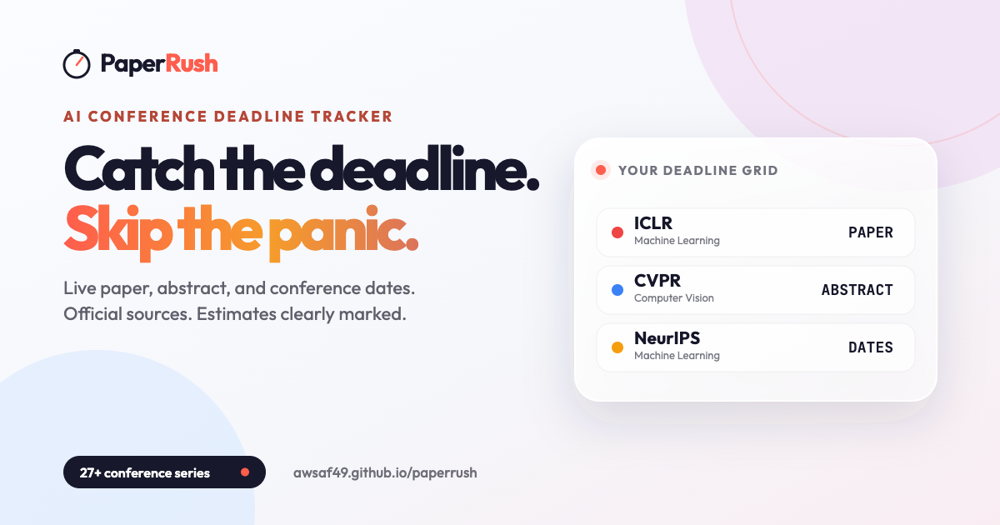

<p align="center">
  
  
  
</p>

<h1 align="center">⏱️ PaperRush</h1>

<p align="center">
  <strong>A clear planning aid for AI conference deadlines.</strong><br>
  Paper, abstract, and conference dates with estimates marked and official sources linked
</p>

<p align="center">
  <a href="https://awsaf49.github.io/paperrush/">🌐 Live Demo</a> •
  <a href="#-features">Features</a> •
  <a href="#-quick-start">Quick Start</a> •
  <a href="#-contributing">Contributing</a>
</p>

<p align="center">

</p>

---

## ✨ Features

| Feature | Description |
|---------|-------------|
| 🎨 **Focused UI** | Deadline-race visual system with responsive liquid-glass controls |
| 📅 **Calendar View** | Day/Week/Month/Year views with deadline chips |
| 🎯 **Deadline Focus** | Default to paper + abstract, or filter paper, abstract, conference, and all dates |
| ⏱️ **Live Countdown** | Real-time timers with smart formatting |
| 🔄 **Auto-Updates** | Automated, LLM-assisted extraction backed by validation rules |
| 🛡️ **Safe Rollover** | Prior-cycle dates appear as `Approx` and are replaced by verified scrape results |
| 🔍 **Smart Search** | Filter by category, search with `⌘K` |
| 🔖 **My Rush** | Save conference series locally across annual editions |
| 📡 **Rush Radar** | Compare the spacing between saved deadlines without overstating estimates |
| 📤 **Calendar & Share** | Export calendars, share a watchlist link, or generate a social image |
| 🌐 **Searchable Pages** | Crawlable, share-ready pages are generated for every active conference series |
| 💬 **One-Tap Feedback** | Record quick feedback or open a prefilled detailed report |
| 📱 **Responsive** | Works on desktop, tablet, and mobile |

### Conferences Tracked

| Category | Conferences |
|----------|-------------|
| **ML** | ICML, NeurIPS, ICLR, AAAI, IJCAI, AISTATS, MLSys, COLT, KDD |
| **Vision** | CVPR, ICCV, ECCV, WACV, ICIP, MICCAI, BMVC, 3DV |
| **NLP** | ACL, EACL, EMNLP, NAACL, COLING |
| **Speech** | Interspeech, ICASSP |
| **Robotics** | ICRA, IROS, CoRL |

---

## 🚀 Quick Start

### Option 1: Use Directly
Visit **[https://awsaf49.github.io/paperrush/](https://awsaf49.github.io/paperrush/)** - no installation needed!

### Option 2: Self-Host

```bash
# Clone the repo
git clone https://github.com/awsaf49/paperrush.git
cd paperrush

# Open in browser (no build required!)
open index.html
```

### Option 3: Deploy Your Own

1. **Fork** this repository
2. Go to **Settings → Pages**
3. Set source to `main` branch
4. Your site is live at `https://yourusername.github.io/paperrush/`

---

## 🤖 Auto-Update System

PaperRush uses an LLM-powered scraper to automatically update conference deadlines.

### Setup (Optional)

To enable auto-updates on your fork:

1. Get a [Gemini API key](https://aistudio.google.com/apikey) (free tier available)
2. Add it as a GitHub Secret: `Settings → Secrets → Actions → GEMINI_API_KEY`

### Trigger Methods

| Method | How |
|--------|-----|
| **Weekly** | Automatic every Monday 6 AM UTC |
| **On Push** | Include `[scrape]` in commit message |
| **Manual** | Actions → "Update Conference Deadlines" → Run |

### System Architecture

```
🌐 Conference Websites → 🤖 Gemini LLM → 📄 JSON → 📦 data.js → 🔎 Conference Pages + Sitemap → 🌍 GitHub Pages
```

📊 **See full interactive workflow diagrams**: [`docs/workflow.html`](docs/workflow.html)

---

## 🤝 Contributing

We welcome contributions! See **[`CONTRIBUTING.md`](CONTRIBUTING.md)** for the complete guide.

**Quick start:** Edit `js/data.js` and submit a PR:

```javascript
{
    id: "conf-2026",
    name: "CONF",
    year: 2026,
    category: "ml",  // ml, cv, nlp, speech, robotics, other
    website: "https://conf.cc/",
    location: { city: "City", country: "Country", flag: "🏳️" },
    deadlines: [
        { type: "paper", label: "Paper Submission", date: "2026-01-22T23:59:00-12:00" },
        { type: "notification", label: "Notification", date: "2026-04-01" },
        { type: "conference", label: "Main Conference", date: "2026-06-15", endDate: "2026-06-20" }
    ],
    links: { official: "https://conf.cc/2026" }
}
```

> **Tip:** Use `-12:00` only when the official source explicitly says AoE. Keep a date date-only when its time or timezone is unknown.

**No build tools needed** - just edit and refresh! See [`CONTRIBUTING.md`](CONTRIBUTING.md) for adding conferences to the scraper, creating new categories, and more

---

## 📊 Data Format Reference

<details>
<summary><strong>Deadline Types</strong></summary>

| Type | Description |
|------|-------------|
| `abstract` | Abstract submission |
| `paper` | Full paper submission |
| `rebuttal` | Author rebuttal period |
| `notification` | Acceptance notification |
| `camera` | Camera-ready deadline |
| `conference` | Confirmed conference dates (use `endDate` for range) |
| `event` | Other administrative or program milestones |

</details>

<details>
<summary><strong>Categories</strong></summary>

| Category | Color | Conferences |
|----------|-------|-------------|
| `ml` | Purple | ICML, NeurIPS, ICLR, AAAI, AISTATS, KDD |
| `cv` | Blue | CVPR, ICCV, ECCV, WACV, ICIP |
| `nlp` | Green | ACL, EACL, EMNLP, NAACL, COLING |
| `speech` | Orange | Interspeech, ICASSP |
| `robotics` | Hot Pink | ICRA, IROS |
| `other` | Gray | Others |

</details>

<details>
<summary><strong>Full Conference Schema</strong></summary>

```javascript
{
    id: "conf-2026",           // Unique ID
    name: "CONF",              // Short name
    fullName: "Full Name",     // Optional
    year: 2026,
    category: "ml",
    website: "https://...",
    brandColor: "#1E3A5F",     // Optional hex color
    location: {
        city: "City",
        country: "Country",
        flag: "🏳️",
        venue: "Venue"         // Optional
    },
    deadlines: [...],
    links: {
        official: "...",
        cfp: "...",            // Call for papers
        template: "...",       // LaTeX template
        author: "..."          // Author guidelines
    },
    info: {
        pageLimit: "8 pages",
        reviewType: "Double-blind",
        acceptanceRate: "~25%"
    },
    notes: ["Note 1", "Note 2"],
    deskRejectReasons: ["Reason 1"]
}
```

</details>

---

## 🛣️ Roadmap

- [ ] Dark mode
- [ ] Calendar export (ICS)
- [ ] Email notifications
- [ ] Timezone selector
- [ ] Favorite conferences
- [ ] PWA offline support
- [x] ~~More conferences (robotics, HCI, security)~~ Added IROS, ICIP, WACV
- [ ] More conferences (HCI, security)

See [Issues](https://github.com/awsaf49/paperrush/issues) for detailed tasks.

---

## 🛠️ Tech Stack

| Component | Technology |
|-----------|------------|
| Frontend | Vanilla HTML/CSS/JS |
| Fonts | Outfit, JetBrains Mono |
| Hosting | GitHub Pages |
| Scraper | Python + Gemini API |
| Automation | GitHub Actions |

**No build tools.** No npm. No webpack. Just clean, simple code.

---

## 📄 License

Apache 2.0 License - free to use, modify, and distribute.

---

<p align="center">
  <strong>⭐ Star this repo if you find it useful!</strong><br><br>
  Built with ❤️ by <a href="https://github.com/awsaf49">Awsaf Rahman</a>
</p>
